# System Architecture for "BeautyInsights 360"

## Introduction

**Overview of the Beauty Brand System**
The BeautyInsights 360 system is designed to enhance the operations and customer engagement of a leading beauty brand with over 500 diverse beauty products. This system aims to provide in-depth analysis of customer information, shopping behaviors, and product reviews to offer personalized product recommendations and improve overall customer satisfaction. By integrating data from multiple sources, the system enables sales personnel to better understand customer needs and recommend suitable products, thereby optimizing the shopping experience.

**Project Objectives**
The primary objectives of the BeautyInsights 360 system are:
- To analyze customer data, shopping behaviors, and product reviews to provide valuable insights.
- To recommend products to customers based on their preferences and behaviors.
- To create a comprehensive product knowledge graph to assist sales personnel in making informed recommendations.
- To integrate customer data and transaction data from multiple systems into a unified platform.

**Project Scope**
The scope of the BeautyInsights 360 system includes:
- Data integration from various customer information and transaction systems.
- Development of analytical models for customer behavior, product performance, and sales trends.
- Implementation of a recommendation engine to suggest products to customers.
- Creation of a product knowledge graph to support sales personnel.
- Deployment and maintenance of the system to ensure continuous improvement and adaptation to market needs.

## System Requirements

The system requirements for BeautyInsights 360 encompass various analytical capabilities aimed at understanding customer behavior, product performance, and sales trends. These analyses will drive personalized recommendations and optimize marketing and sales strategies. The system will integrate data from multiple sources, ensuring comprehensive and actionable insights.

### Customer Behavior Analysis

| Analysis                | Objective                                                                      | Metrics                                      |
|-------------------------|--------------------------------------------------------------------------------|----------------------------------------------|
| Customer Segmentation   | Group customers based on purchasing behavior, demographics, or interactions    | Purchase frequency, average order value, preferred product categories, review activity |
| Customer Lifetime Value (CLV) Analysis | Calculate the projected revenue a customer will generate over their relationship with the business | Average purchase value, purchase frequency, customer lifespan |
| Churn Analysis          | Identify customers at risk of leaving and understand factors contributing to churn | Churn rate, time to churn, reasons for churn (e.g., negative reviews) |
| Customer Journey Analysis | Map out and analyze the customer's journey from discovery to purchase to improve the shopping experience | Customer touchpoints, time to purchase, drop-off points in the sales funnel |
| Personalized Marketing  | Create targeted marketing campaigns based on customer preferences and behavior  | Email open rate, click-through rate, conversion rate of personalized offers |

### Product Performance and Feedback

| Analysis                | Objective                                                                      | Metrics                                      |
|-------------------------|--------------------------------------------------------------------------------|----------------------------------------------|
| Product Performance Analysis | Evaluate product sales performance, customer satisfaction, and identify top-performing products | Sales volume, average rating, number of reviews, return rates |
| Review and Sentiment Analysis | Analyze customer feedback to understand product strengths and areas for improvement | Average rating, sentiment score of reviews, common themes in feedback |

### Sales and Promotion Analysis

| Analysis                | Objective                                                                      | Metrics                                      |
|-------------------------|--------------------------------------------------------------------------------|----------------------------------------------|
| Sales Trend Analysis    | Identify sales patterns and seasonal trends to optimize inventory and marketing efforts | Daily, weekly, monthly sales trends, year-over-year growth, seasonal spikes |
| Promotion Effectiveness Analysis | Evaluate the impact of promotions and discounts on sales and customer acquisition | Promotion ROI, sales uplift, customer acquisition cost |
| Cross-Sell and Upsell Analysis | Identify opportunities to recommend complementary or higher-value products | Cross-sell and upsell rates, average order value, customer acceptance rate of recommendations |

### Recommendation System Analysis

| Analysis                | Objective                                                                      | Metrics                                      |
|-------------------------|--------------------------------------------------------------------------------|----------------------------------------------|
| Recommendation Effectiveness | Assess the impact of recommendations on sales and customer engagement | Conversion rate of recommended products, click-through rate, purchase rate of recommended products |

### Inventory and Demand Analysis

| Analysis                | Objective                                                                      | Metrics                                      |
|-------------------------|--------------------------------------------------------------------------------|----------------------------------------------|
| Market Basket Analysis  | Identify products frequently bought together to optimize cross-selling and upselling strategies | Association rules, lift, confidence          |
| Inventory Optimization  | Ensure optimal stock levels to meet demand without overstocking                | Inventory turnover rate, stockout rate, reorder points |
| Demand Forecasting      | Predict future demand for products to inform supply chain and marketing decisions | Forecast accuracy, sales projections, demand peaks |

## Architecture and Design

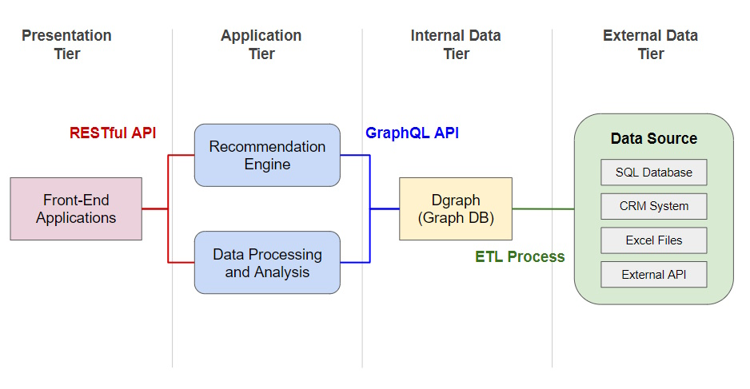

### Whiteboard Architecture Diagram

This system architecture diagram for BeautyInsights 360 illustrates a comprehensive setup divided into four main tiers: Presentation Tier, Application Tier, Internal Data Tier, and External Data Tier. Here’s a detailed explanation of each component and how they interact:

### Presentation Tier

**Components**:
- **Front-End Applications**: These are the client interfaces through which users interact with the system. These could be web applications, mobile applications, or any other type of user interface.

**Interactions**:
- **RESTful API**: The front-end applications use RESTful APIs to communicate with the application tier. This API handles requests from the user interface, fetches data, and sends it back to the client.

### Application Tier

**Components**:
- **Recommendation Engine**: This component is responsible for generating personalized product recommendations for users. It uses data from the central database and applies various algorithms to suggest relevant products to individual users.
- **Data Processing and Analysis**: This component handles the processing and analysis of data to extract valuable insights. It includes advanced analytics and machine learning models for tasks such as customer segmentation, churn prediction, and trend analysis.

**Interactions**:
- **GraphQL API**: The application tier interacts with the internal data tier through a GraphQL API. This API provides a flexible and efficient interface for querying and interacting with the data stored in the Dgraph database.

### Internal Data Tier

**Components**:
- **Dgraph (Graph DB)**: This is the central database that stores and manages the integrated data. Dgraph uses a graph-based structure to efficiently handle complex relationships and support advanced queries.
- **ETL Process**: The ETL (Extract, Transform, Load) process is responsible for consolidating data from various external sources into the Dgraph database. 

**Interactions**:
- **GraphQL API**: The Dgraph database is accessed and queried through the GraphQL API by the application tier.
- **ETL Process**: The ETL process extracts data from external sources, transforms it into a suitable format, and loads it into the Dgraph database.

### External Data Tier
**Components**:
- **Data Sources**: This tier includes various sources of data that feed into the system. These data sources include:
  - **SQL Databases**: Contain structured customer information and historical data.
  - **CRM Systems**: Store detailed customer profiles, interactions, and sales records.
  - **Excel Files**: Include supplementary customer data and manual entries.
  - **External APIs**: Provide additional customer insights and third-party data.

**Interactions**:
- **ETL Process**: Data from these external sources is extracted, transformed, and loaded into the Dgraph database by the ETL process.

### Data Flow Summary
1. **External Data Sources** provide raw data which is extracted, transformed, and loaded by the **ETL Process** into the **Dgraph** database in the Internal Data Tier.
2. The **Data Processing and Analysis** component processes and analyzes this data to generate insights.
3. The **Recommendation Engine** uses these insights to provide personalized recommendations.
4. The **GraphQL API** facilitates interaction between the Internal Data Tier and the Application Tier, enabling efficient data queries and operations.
5. **Front-End Applications** in the Presentation Tier interact with the system through the **RESTful API**, allowing users to access recommendations and insights generated by the Application Tier.

## Data Integration and Analysis

The architecture of BeautyInsights 360 is designed to seamlessly integrate various data sources, process and analyze the data, and provide personalized product recommendations. The following components are central to the system:

### Data Sources and Integration Points
- **Customer Data Sources:**
  - **SQL Databases:** Contain structured customer information and historical data.
  - **CRM Systems:** Store detailed customer profiles, interactions, and sales records.
  - **Excel Files:** Include supplementary customer data and manual entries.
  - **External APIs:** Provide additional customer insights and third-party data.

- **Customer Transaction Data Sources:**
  - **SQL Databases:** Record transactional data such as purchases and returns.
  - **CRM Systems:** Capture transactional interactions and customer service records.
  - **External APIs:** Include external sales channels and partner data.

Integration between these systems is achieved through an ETL (Extract, Transform, Load) process that consolidates data into a unified platform for analysis.

### Data Processing and Analysis
- **Data Ingestion and Transformation:**
  - ETL processes extract data from various sources, transform it into a common format, and load it into the central database.
  - **Dgraph:** Serves as the primary database for storing and managing the integrated data, leveraging its graph-based structure to efficiently handle complex relationships.

- **Data Analysis:**
  - Advanced analytics are performed on the integrated data to gain insights into customer behavior, product performance, and sales trends.
  - Machine learning models are employed for customer segmentation, churn prediction, and personalized marketing.

### Recommendation Engine
- **GraphQL API:**
  - Provides a flexible and efficient interface for querying and interacting with the data stored in Dgraph.
  - Enables the recommendation engine to fetch relevant data and generate personalized product suggestions.

- **Recommendation Algorithms:**
  - Utilize the insights derived from data analysis to recommend products tailored to individual customer preferences and behaviors.
  - Continuously refine recommendations based on real-time customer interactions and feedback.

## Design Decisions and Justifications

### Benefits of Choosing Dgraph over SQL Database

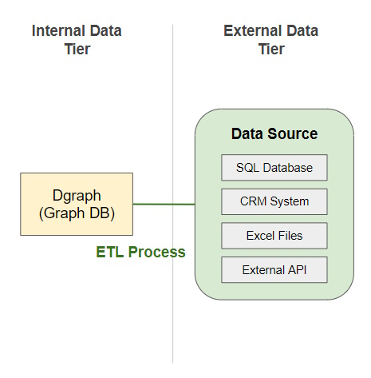

Choosing Dgraph over a traditional SQL database for the BeautyInsights 360 project offers significant benefits in handling complex relationships, scalability, flexibility, performance, and simplified schema management. These advantages make Dgraph an ideal choice for building a robust, scalable, and efficient system for customer data analysis and product recommendations.

| **Criteria**                         | **Dgraph**                                                                                                          | **SQL Database**                                                                                                    |
|--------------------------------------|--------------------------------------------------------------------------------------------------------------------|--------------------------------------------------------------------------------------------------------------------|
| **Data Model**                       | Graph-based, excels at managing complex relationships and interconnected data                                       | Relational, uses tables and foreign keys to represent relationships                                                |
| **Relationship Handling**            | Stores relationships as first-class entities, making traversal and querying more efficient                          | Relationships are managed through foreign keys and joins, which can be less efficient                              |
| **Scalability**                      | Designed for horizontal scalability, can handle increasing data volumes by adding more servers                      | Typically scales vertically, which can be more limited and costly                                                   |
| **Schema Design**                    | Schema-less, providing flexibility to accommodate diverse and evolving data types                                   | Requires predefined schemas, making it less flexible for evolving data models                                      |
| **Data Integration**                 | Simplifies the ETL process, allowing easy adjustments and expansions to the data model without extensive modifications | Requires complex transformations to fit data into rigid schemas                                                     |
| **Query Capabilities**               | Natively supports GraphQL, providing a powerful and flexible query language for interacting with the data           | Typically uses SQL, which can be less flexible and require more complex queries for similar tasks                   |
| **API and Backend Schema**           | Generates a GraphQL API and graph backend from a single GraphQL schema, simplifying development and maintenance     | Requires separate schemas and more effort to maintain consistency between API and backend                           |
| **Unified Schema Management**        | Ensures consistency between the data model and the API, reducing potential errors and discrepancies                 | Separate schemas for API and backend can lead to inconsistencies and increased maintenance effort                   |

### Benefits of GraphQL API Between Application and Data Tiers

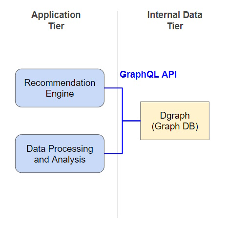

Using GraphQL API between the Application Tier and the Internal Data Tier in the BeautyInsights 360 project offers substantial benefits over RESTful API in terms of flexibility, efficiency, real-time capabilities, and developer experience. GraphQL’s ability to precisely query the needed data, its strong typing system, and single endpoint architecture simplify integration and enhance performance, making it an ideal choice for connecting the Recommendation Engine and Data Processing and Analysis components with the Dgraph database.

| **Criteria**                   | **GraphQL API**                                                                                  | **RESTful API**                                                                                   |
|--------------------------------|--------------------------------------------------------------------------------------------------|--------------------------------------------------------------------------------------------------|
| **Unified API and Backend**    | Dgraph lets you generate a GraphQL API and a graph backend from a single GraphQL schema, reducing development effort. | Requires separate schemas and more effort to maintain consistency between API and backend.        |
| **Data Retrieval**             | Clients can specify exactly what data they need, minimizing over-fetching and under-fetching.    | Endpoints return fixed data structures, often leading to over-fetching or under-fetching.        |
| **Endpoint Management**        | Provides a single endpoint for all queries and mutations.                                        | Requires multiple endpoints for different resources and operations, increasing complexity.       |
| **Schema and Typing**          | Strong typing system with a clear schema defining data structure and relationships.              | Often lacks a formal schema, making the data model harder to understand and increasing errors.   |
| **Introspection**              | Supports introspection, allowing clients to query the schema to understand available types and operations. | Typically requires separate documentation, which can become outdated and may not be as comprehensive. |
| **Data Aggregation**           | Can fetch and aggregate data from multiple related resources in a single query.                  | Requires multiple requests to different endpoints and additional client-side logic to aggregate data. |
| **Flexibility**                | Schema-less design provides flexibility to accommodate diverse and evolving data types.           | Requires predefined schemas, making it less flexible for evolving data models.                   |

### Benefits of Using RESTful API Between Presentation and Application Tier

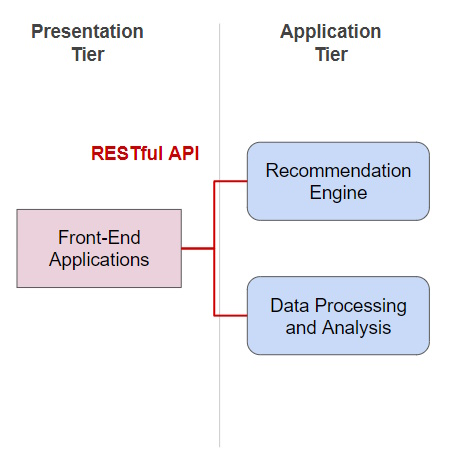

Using a RESTful API between the Presentation Tier and the Application Tier in BeautyInsights 360 ensures simplicity, broad compatibility, efficient performance, robust security, and clear resource modeling, making it an ideal choice for connecting front-end applications with back-end services.

**1. Simplicity and Ease of Use**:
- **Widely Adopted**: Based on standard HTTP methods (GET, POST, PUT, DELETE), making it easy for developers to implement and maintain.
- **Stateless Operations**: Simplifies design and ensures reliable interactions.

**2. Compatibility and Integration**:
- **Broad Compatibility**: Easily consumed by web browsers, mobile apps, and third-party services.
- **Easy Integration**: Compatible with a wide range of tools and libraries, enabling faster development.

**3. Performance and Scalability**:
- **Efficient Caching**: Supports HTTP caching to reduce repeated data fetching, improving performance.
- **Load Balancing**: Stateless nature allows for easy distribution of load across multiple servers.

**4. Security and Control**:
- **Standard Security Practices**: Uses SSL/TLS for encryption and OAuth for authorization, ensuring secure data exchange.
- **Access Control**: Allows fine-grained access control to manage permissions effectively.

**5. Clear Resource Modeling**:
- **Resource-Oriented Architecture**: Easy to model and organize API endpoints around resources.
- **Consistency**: Promotes a clear and intuitive API structure, making it user-friendly.

## Introduction to Analysis Categories

The BeautyInsights 360 system leverages advanced data analysis techniques to provide valuable insights into customer behavior, product performance, sales trends, recommendation effectiveness, and inventory management. By utilizing a comprehensive GraphQL schema, the system can conduct various analyses that support informed decision-making and enhance business outcomes. Below are the key analysis categories and their significance:

- **Customer Behavior Analysis**: 
Understanding customer behavior is crucial for tailoring marketing strategies, improving customer retention, and enhancing the overall shopping experience. This category includes analyses such as customer segmentation, lifetime value calculation, churn analysis, customer journey mapping, and personalized marketing.

- **Product Performance and Feedback Analysis**:
Evaluating product performance and customer feedback helps identify top-performing products, understand customer satisfaction, and pinpoint areas for improvement. This category covers product performance analysis and review sentiment analysis.

- **Sales and Promotion Analysis**:
Analyzing sales trends and the effectiveness of promotions provides insights into seasonal patterns, the impact of marketing efforts, and opportunities for cross-selling and upselling. This category includes sales trend analysis, promotion effectiveness evaluation, and cross-sell and upsell analysis.

- **Recommendation System Analysis**:
Assessing the effectiveness of the recommendation system ensures that the suggestions provided to customers are relevant and engaging, thereby improving customer satisfaction and increasing sales. This category focuses on recommendation effectiveness analysis.

- **Inventory and Demand Analysis**:
Efficient inventory management and demand forecasting are vital for maintaining optimal stock levels, minimizing stockouts, and meeting customer demand. This category includes market basket analysis, inventory optimization, and demand forecasting.

By implementing these analyses, BeautyInsights 360 can derive actionable insights from data, enabling better strategic decisions, personalized customer experiences, and optimized business operations.

### Analysis Cases

This table summarizes the key analysis cases within each category, providing a clear overview of the types of insights that can be derived from the BeautyInsights 360 system.

| **Category**                     | **Analysis Case**                                               | **Description**                                                                                       |
|----------------------------------|-----------------------------------------------------------------|-------------------------------------------------------------------------------------------------------|
| **Customer Behavior Analysis**   | **Customer Segmentation**                                       | Group customers based on purchasing behavior, demographics, or interactions.                          |
|                                  | **Customer Lifetime Value (CLV) Analysis**                      | Calculate the projected revenue a customer will generate over their relationship with the business.    |
|                                  | **Churn Analysis**                                              | Identify customers at risk of leaving and understand factors contributing to churn.                    |
|                                  | **Customer Journey Analysis**                                   | Map out and analyze the customer's journey from discovery to purchase to improve the shopping experience. |
|                                  | **Personalized Marketing**                                      | Create targeted marketing campaigns based on customer preferences and behavior.                        |
| **Product Performance and Feedback Analysis** | **Product Performance Analysis**                            | Evaluate product sales performance, customer satisfaction, and identify top-performing products.        |
|                                  | **Review and Sentiment Analysis**                               | Analyze customer feedback to understand product strengths and areas for improvement.                   |
| **Sales and Promotion Analysis** | **Sales Trend Analysis**                                        | Identify sales patterns and seasonal trends to optimize inventory and marketing efforts.               |
|                                  | **Promotion Effectiveness Analysis**                            | Evaluate the impact of promotions and discounts on sales and customer acquisition.                     |
|                                  | **Cross-Sell and Upsell Analysis**                              | Identify opportunities to recommend complementary or higher-value products.                            |
| **Recommendation System Analysis** | **Recommendation Effectiveness**                              | Assess the impact of recommendations on sales and customer engagement.                                 |
| **Inventory and Demand Analysis** | **Market Basket Analysis**                                     | Identify products frequently bought together to optimize cross-selling and upselling strategies.       |
|                                  | **Inventory Optimization**                                      | Ensure optimal stock levels to meet demand without overstocking.                                       |
|                                  | **Demand Forecasting**                                          | Predict future demand for products to inform supply chain and marketing decisions.                     |

### Customer Behavior Analysis

**Customer Segmentation**:
Group customers based on purchasing behavior, demographics, or interactions.
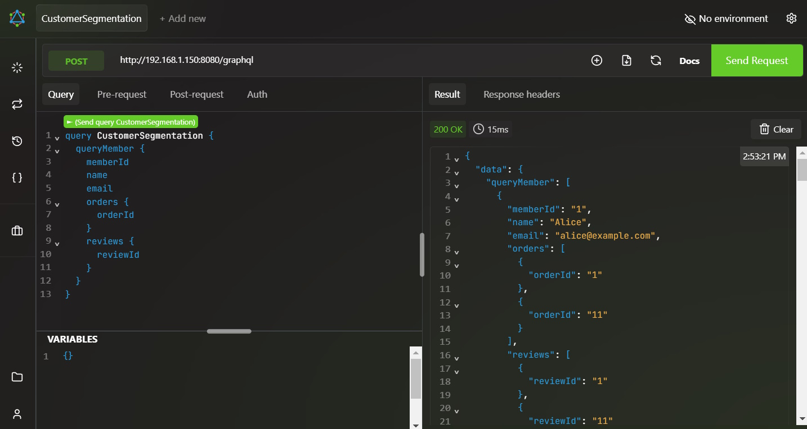

**Customer Lifetime Value (CLV) Analysis**:
Calculate the projected revenue a customer will generate over their relationship with the business.
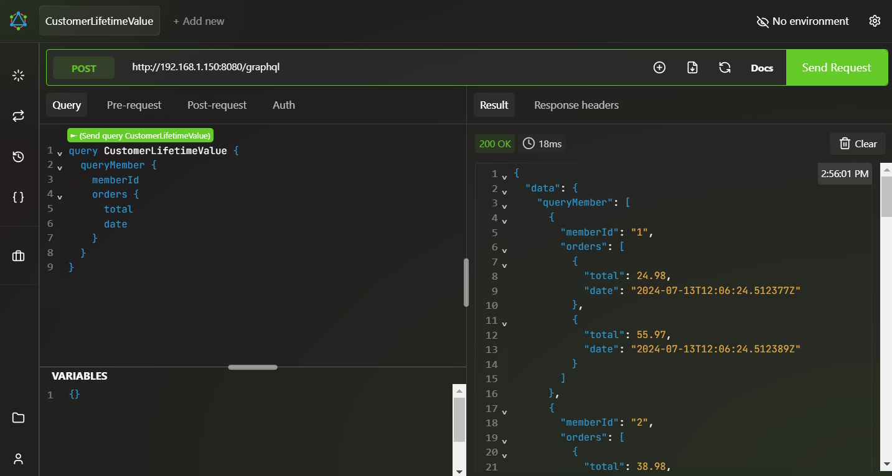

**Churn Analysis**:
Identify customers at risk of leaving and understand factors contributing to churn.
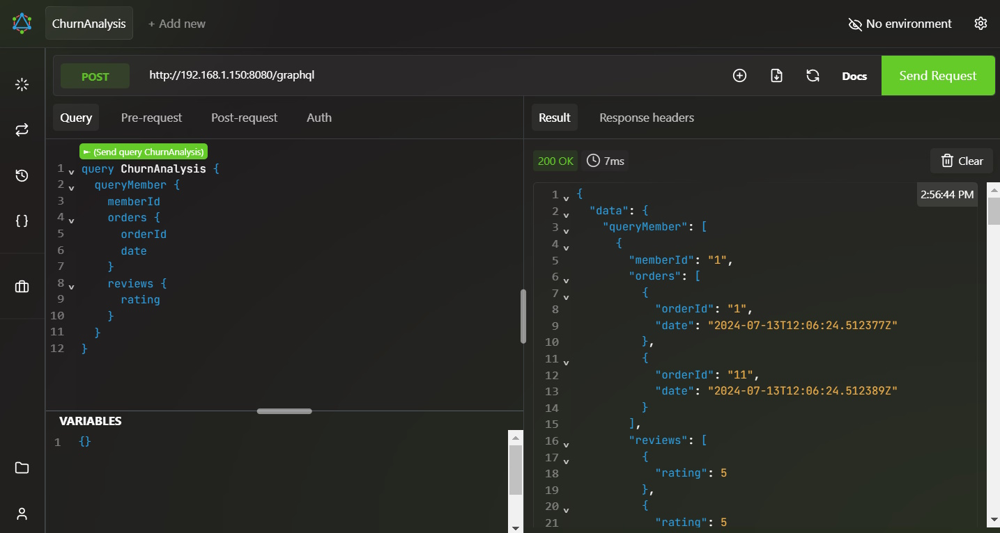

**Customer Journey Analysis**:
Map out and analyze the customer's journey from discovery to purchase to improve the shopping experience.
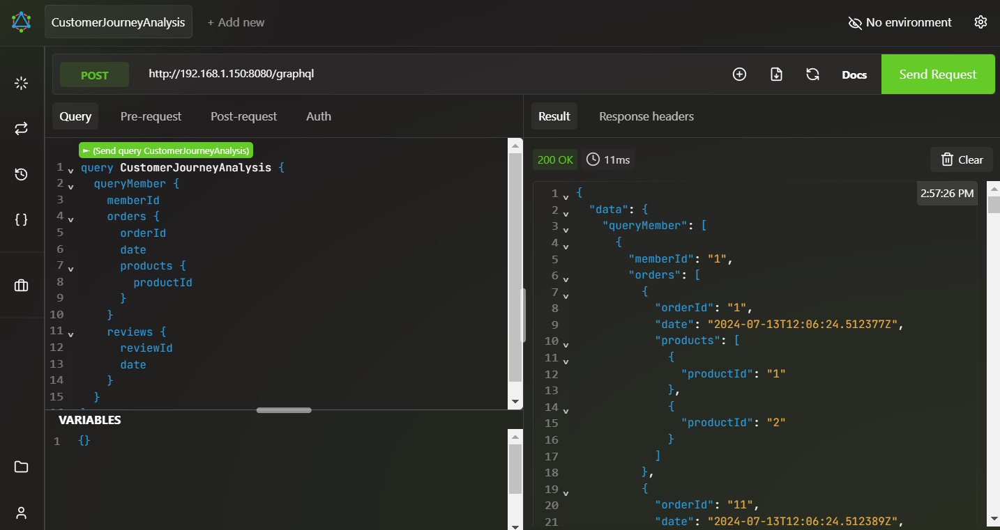

**Personalized Marketing**:
Create targeted marketing campaigns based on customer preferences and behavior.

### Product Performance and Feedback Analysis

**Product Performance Analysis**:
Evaluate product sales performance, customer satisfaction, and identify top-performing products.
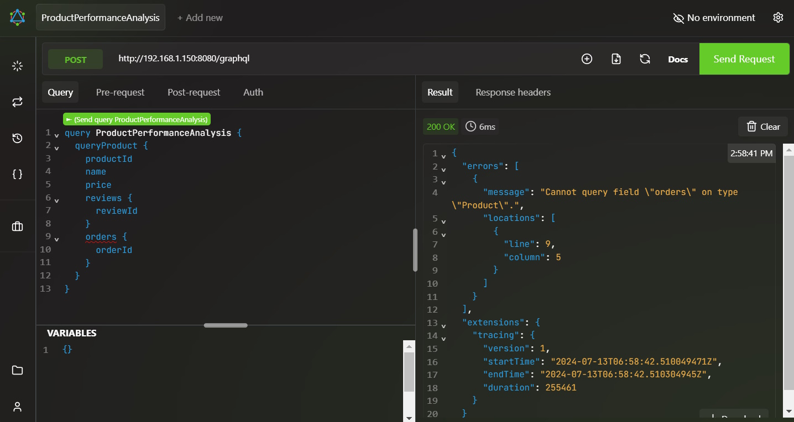

**Review and Sentiment Analysis**:
Analyze customer feedback to understand product strengths and areas for improvement.
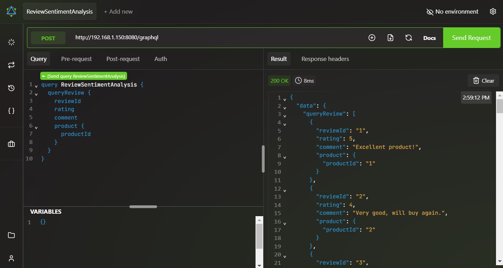

### Sales and Promotion Analysis

**Sales Trend Analysis**:
Identify sales patterns and seasonal trends to optimize inventory and marketing efforts.
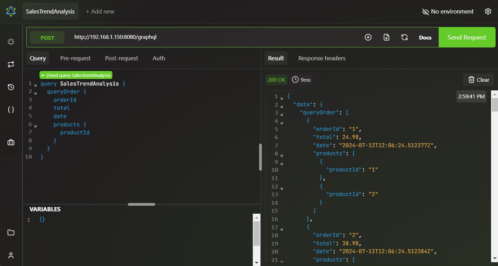

**Promotion Effectiveness Analysis**:
Evaluate the impact of promotions and discounts on sales and customer acquisition.
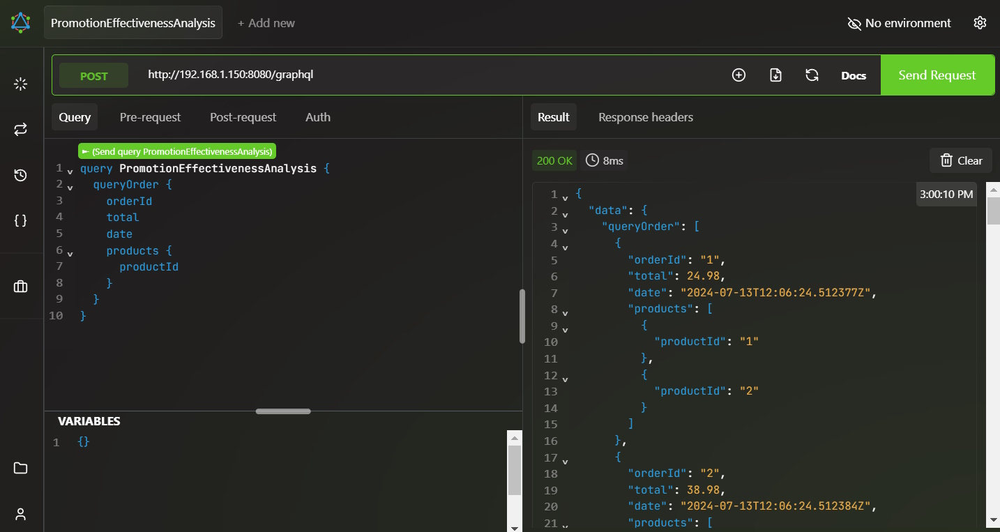

**Cross-Sell and Upsell Analysis**:
Identify opportunities to recommend complementary or higher-value products.
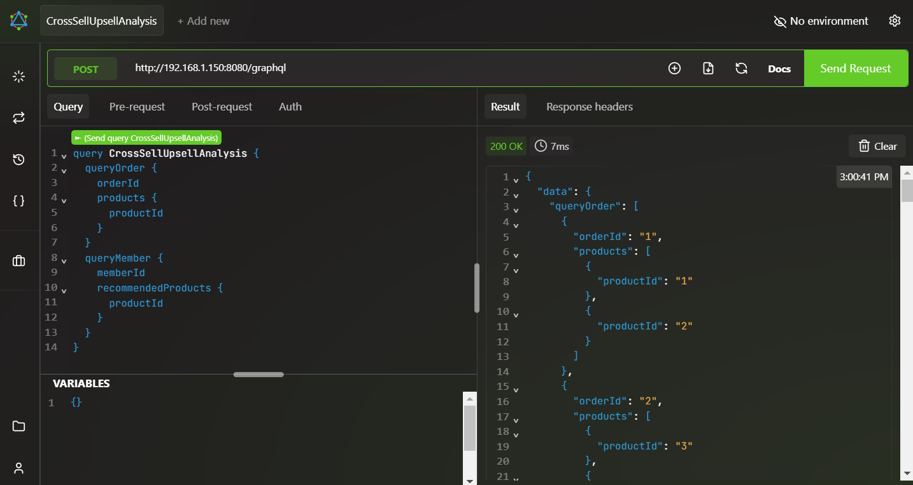

### Recommendation System Analysis

**Recommendation Effectiveness**:
Assess the impact of recommendations on sales and customer engagement.

### Inventory and Demand Analysis

**Market Basket Analysis**:
Identify products frequently bought together to optimize cross-selling and upselling strategies.
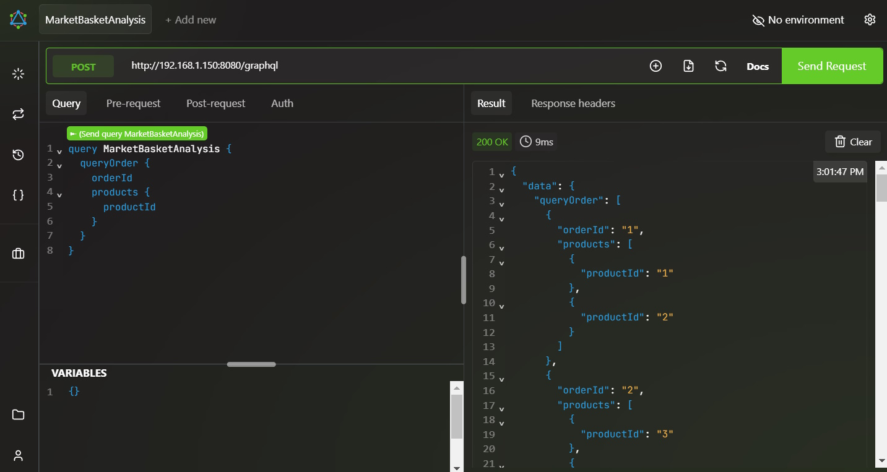

**Inventory Optimization**:
Ensure optimal stock levels to meet demand without overstocking.

**Demand Forecasting**:
Predict future demand for products to inform supply chain and marketing decisions.

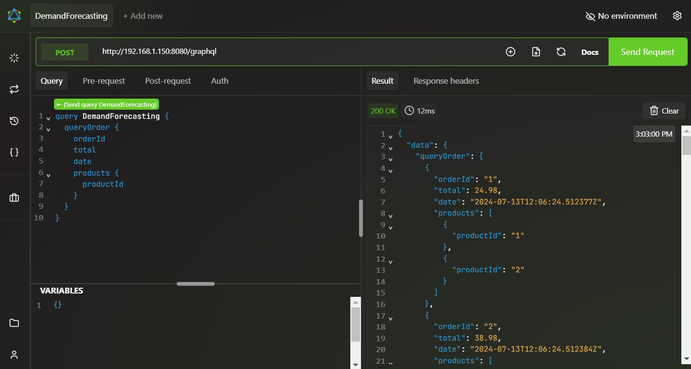

### Conclusion

The BeautyInsights 360 project offers a robust and scalable solution for analyzing customer behavior, product performance, and sales trends within the beauty industry. By leveraging the power of Dgraph's graph database and GraphQL API, the system efficiently manages complex data relationships and provides real-time insights and personalized recommendations. The modular architecture ensures ease of integration and maintenance, while the combination of advanced analytics and machine learning enhances decision-making and strategic planning.

The comprehensive design, including detailed documentation and example scripts, facilitates easy setup and usage. With the benefits of Dgraph's scalability and flexibility, along with the powerful querying capabilities of GraphQL, BeautyInsights 360 is well-equipped to drive business growth and improve customer experiences. By utilizing RESTful APIs for the presentation tier and GraphQL for internal data management, the project achieves a balanced and efficient architecture that meets the needs of both developers and end-users.

BeautyInsights 360 stands out as a sophisticated and user-friendly system, poised to deliver valuable insights and drive better business outcomes for beauty brands.

